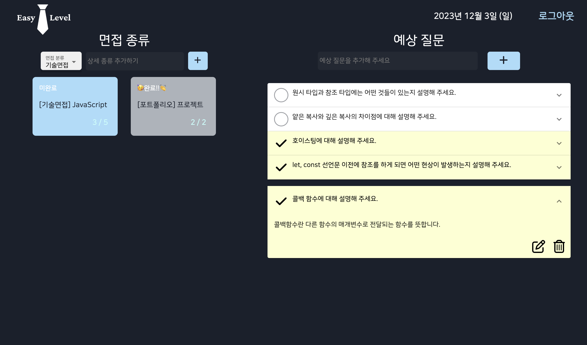
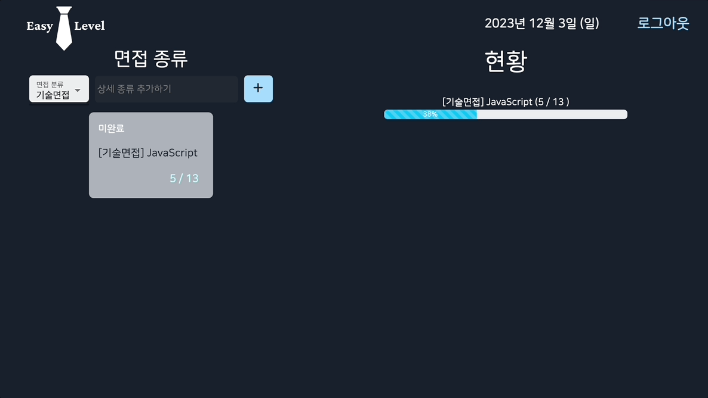
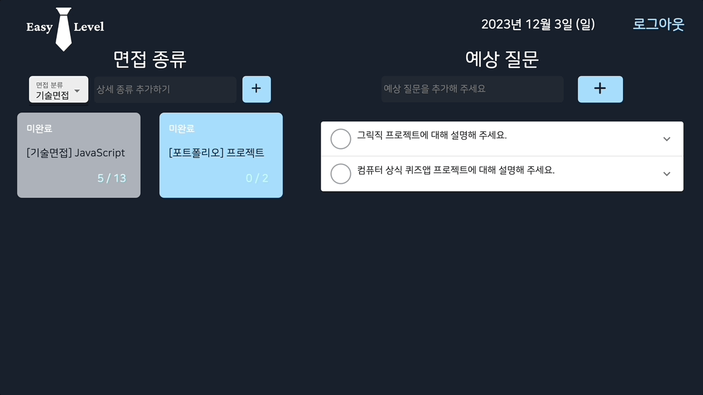
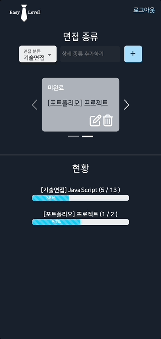

# Easy Level

<div align="center">
  

**배포 링크**: https://easylevel.biyamn.dev

</div>

<br>

## 구현 과정 블로깅

- <a href='https://velog.io/@hamham/%ED%88%AC%EB%91%90%EB%A6%AC%EC%8A%A4%ED%8A%B8-%EB%A7%8C%EB%93%A4%EA%B8%B0-ChatGPT'>추가 기능, 빈칸 검증 기능 만들기</a>
- <a href='https://velog.io/@hamham/%ED%88%AC%EB%91%90%EB%A6%AC%EC%8A%A4%ED%8A%B8-2%ED%83%84-CSS-%EC%B6%94%EA%B0%80%ED%95%98%EA%B8%B0'>CSS 추가하기</a>
- <a href='https://velog.io/@hamham/%ED%88%AC%EB%91%90%EB%A6%AC%EC%8A%A4%ED%8A%B8-3%ED%83%84-%EC%82%AD%EC%A0%9C-%EA%B8%B0%EB%8A%A5-%EA%B5%AC%ED%98%84%ED%95%98%EA%B8%B0'>삭제 기능 만들기</a>
- <a href='https://velog.io/@hamham/%ED%88%AC%EB%91%90%EB%A6%AC%EC%8A%A4%ED%8A%B8-4%ED%83%84-%EC%82%AD%EC%A0%9C-%EA%B8%B0%EB%8A%A5-%EC%88%98%EC%A0%95%ED%95%98%EA%B8%B0'>삭제 기능 개선하기</a>
- <a href='https://velog.io/@hamham/%ED%88%AC%EB%91%90%EB%A6%AC%EC%8A%A4%ED%8A%B8-5%ED%83%84-%EC%99%84%EB%A3%8C-%EA%B8%B0%EB%8A%A5-%EB%A7%8C%EB%93%A4%EA%B8%B0'>완료 기능 만들기</a>
- <a href='https://velog.io/@hamham/%ED%88%AC%EB%91%90%EB%A6%AC%EC%8A%A4%ED%8A%B8-6%ED%83%84-%EC%88%98%EC%A0%95-%EA%B8%B0%EB%8A%A5-%EB%A7%8C%EB%93%A4%EA%B8%B0'>수정 기능 만들기</a>
- <a href='https://velog.io/@hamham/%ED%88%AC%EB%91%90%EB%A6%AC%EC%8A%A4%ED%8A%B8-7%ED%83%84-%EB%B0%98%EC%9D%91%ED%98%95-%EB%A0%88%EC%9D%B4%EC%95%84%EC%9B%83-%EB%A7%8C%EB%93%A4%EA%B8%B0-%EB%B0%B0%ED%8F%AC%ED%95%98%EA%B8%B0'>반응형 레이아웃 만들기 + 배포하기</a>
- <a href='https://velog.io/@hamham/CRA%EB%A5%BC-Vite%EB%A1%9C-%EB%A7%88%EC%9D%B4%EA%B7%B8%EB%A0%88%EC%9D%B4%EC%85%98'>CRA를 Vite로 마이그레이션</a>
- <a href='https://velog.io/@hamham/Firebase-%EC%88%98%EC%A0%95%EC%8B%9C-%EA%B9%9C%EB%B0%95'>optimistic update</a>
- <a href='https://velog.io/@hamham/%ED%88%AC%EB%91%90%EB%A6%AC%EC%8A%A4%ED%8A%B8-10%ED%83%84-%ED%99%94%EC%82%B4%ED%91%9C-%ED%95%A8%EC%88%98-%EA%B4%80%EB%A0%A8-%EA%B2%AA%EC%9D%80-%EC%98%A4%EB%A5%98'>화살표 함수 관련 겪은 오류</a>
- <a href='https://velog.io/@hamham/%EC%84%9C%EB%B2%84%EC%9D%98-%EB%8D%B0%EC%9D%B4%ED%84%B0%EC%99%80-input%EC%9D%98-value%EB%A5%BC-%EB%8F%99%EA%B8%B0%ED%99%94%ED%95%98%EB%A0%A4%EB%8B%A4%EA%B0%80-%EA%B2%AA%EC%9D%80-%EB%AC%B8%EC%A0%9C'>서버의 데이터와 input의 value를 동기화하려다가 겪은 문제</a>

<br>

## 프로젝트 소개

- 면접 난이도를 '쉬움'으로 만들기 위한 면접 준비 서비스입니다.
- 면접 종류를 추가하고 각 면접 종류 하위에 예상 질문과 답변을 정리할 수 있습니다.
- 현황 페이지에서 각 면접 종류에 따른 답변율을 확인할 수 있습니다.

<br>

## 프로젝트 실행 방법

```
$ npm install
$ npm run dev
```

<br>

## 기능 소개

### 면접 종류 등록

- 면접 종류의 CRUD 기능을 구현하였습니다.
- 면접 종류에서 대분류를 선택하고 소분류를 지정할 수 있습니다.
- 모든 문항을 완료하면 '완료' 상태가, 한 문항이라도 완료하지 않으면 '미완료' 상태가 나타납니다.

|  |
| :-----------------------: |
|         추가하기          |

### 질문, 답변 등록

- 각 면접 종류의 하위에 예상 질문과 답변 CRUD 기능을 구현하였습니다.

|  |
| :----------------------: |
|         추가하기         |

### 반응형

- 뷰포트에 따라 ㅇㅇㅇㅇㅇㅇㅇㅇㅇㅇㅇ반응형 레이아웃을 구현하였습니다.
- 모바일에서는 추가한 면접 종류를 Carousel로 확인할 수 있습니다.

|  |
| :--------------------------------------------: |
|                    추가하기                    |

### Firebase

- Firebase Authentication을 활용하여 Google 로그인 기능을 구현하였습니다.
- Cloud Firestore를 사용하여 로그인 한 사용자의 데이터를 저장하였습니다.

<br>

## 기술 스택

- frontend
  - React
  - JavaScript
- backend
  - Firestore

<br>

## 폴더 구조

```
📦src
 ┣ 📂components
 ┃ ┣ 📂Interview
 ┃ ┃ ┣ 📜Interview.jsx
 ┃ ┃ ┣ 📜InterviewInput.jsx
 ┃ ┃ ┣ 📜InterviewItem.jsx
 ┃ ┃ ┗ 📜InterviewItems.jsx
 ┃ ┣ 📂Question
 ┃ ┃ ┣ 📜Question.jsx
 ┃ ┃ ┣ 📜QuestionInput.jsx
 ┃ ┃ ┣ 📜QuestionItem.jsx
 ┃ ┃ ┣ 📜QuestionItems.jsx
 ┃ ┣ 📜Header.jsx
 ┃ ┣ 📜Progress.jsx
 ┃ ┗ 📜Status.jsx
 ┣ 📂utils
 ┃ ┗ 📜getInitialValue.js
 ┣ 📜App.jsx
 ┗ 📜main.jsx
```
